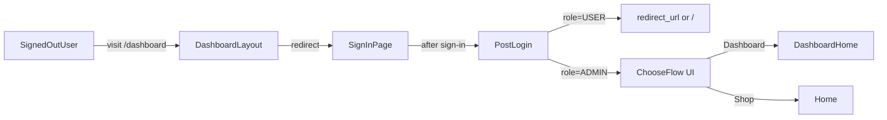
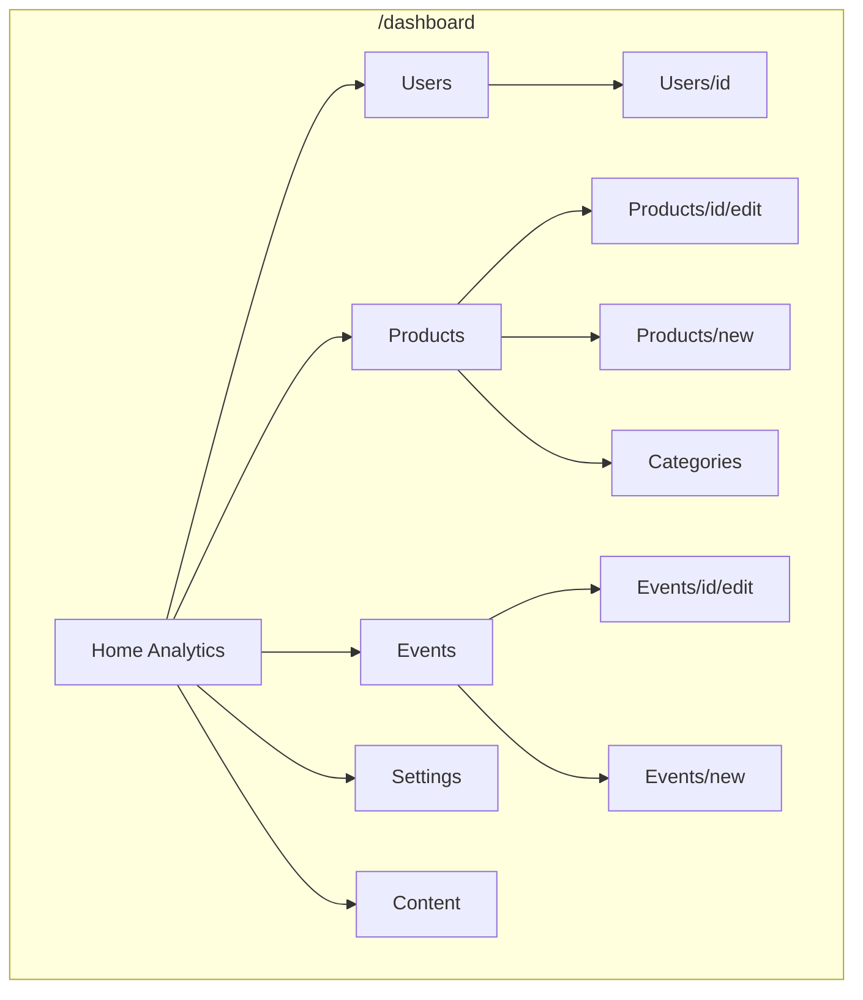
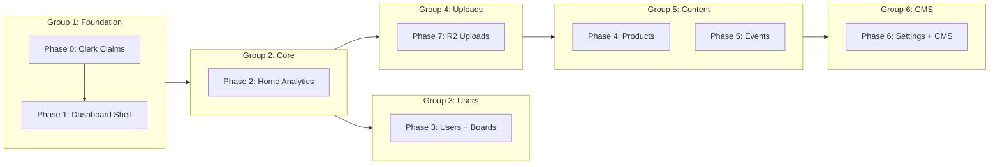

# Admin Dashboard + Flow Chooser + Analytics + Kanban + CMS + R2 Uploads

## Scope (phased, to keep it shippable)

- **Phase 0 (Clerk role claims)**
  - Add Clerk JWT claim `role` emitted from `user.publicMetadata.role`.
  - Keep `publicMetadata.role` synced from Prisma `User.role` (on login bootstrap + when admin changes a user’s role).

- **Phase 1 (foundation + access control)**
  - Add `/dashboard` route group and layout with responsive sidebar (collapsible on mobile).
  - Enforce **signed-in only** and **admin-only** access via **server-side redirects in `src/app/dashboard/layout.tsx`**.
  - Add **client RouteGuard** wrapper to avoid rendering flashes and show skeletons during redirects.
  - Add `/post-login` route: admins see "Shop vs Dashboard" chooser; non-admins redirect immediately.

- **Phase 2 (dashboard home + analytics)**
  - `/dashboard`: **Needs Attention** queues:
    - **Orders**: `PENDING` + `PROCESSING`
    - **Registrations**: `PENDING`
    - **Events**: `UPCOMING` starting within **7 days**
  - Overview stats (keep to a small set of compact summary blocks; do not make the page card-heavy).
  - Low stock product alerts (table/list).
  - Recent orders and registrations (table/list)
  - Do not show the orders or details much. only show the stats, and when clicked on stats it takes you to correct page for it

- **Phase 3 (admin users module + operational boards)**
  - `/dashboard/users`: list/search users by ID/email/name.
  - Role management: promote/demote admin **and sync Clerk metadata**:
    - Update Prisma `User.role`
    - Update Clerk `user.publicMetadata.role` so JWT claim `role` stays correct
    - Note: users may need a session refresh / re-login before their JWT reflects the new role
  - `/dashboard/users/[id]`: user detail with:
    - **Orders board** (Kanban): drag/drop between `OrderStatus` columns.
    - **Registrations board** (Kanban): drag/drop between `EventRegistrationStatus` columns.
    - **Cart** + **Wishlist** read-only views.
  - **Status regression rule**: if a card is moved to an earlier status, **set all timestamps for later statuses to `null`**.

- **Phase 4 (products + categories)**
  - `/dashboard/products`: list/search/filter products with full CRUD (create, edit, delete/deactivate).
  - Product form: name, description, price, quantity, material, color, images (R2), categories, instructions, is_active toggle.
  - Show product reviews with option to delete inappropriate ones.
  - `/dashboard/categories`: manage allowed categories with name + icon mapping.

- **Phase 5 (events + registrations)**
  - `/dashboard/events`: list/search/filter events with full CRUD.
  - Event form: title, description, dates, location, seats, price, instructor, level, status, image, gallery, includes, highlights.
  - View/manage event registrations inline.
  - Show event reviews with delete option.

- **Phase 6 (site settings + CMS)**
  - `/dashboard/settings`: site configuration:
    - Hero images (home page banners)
    - Contact info (address, email, phone, hours)
    - Category icon mappings
  - `/dashboard/content`: static page content management:
    - **About page**: team members, values, process steps
    - **FAQ page**: categories and Q&A pairs
    - **Shipping page**: shipping options, info, returns policy
    - **Care page**: glaze types, warnings

- **Phase 7 (Cloudflare R2 uploads)**
  - Admin-only presigned URL API route.
  - Reusable `R2ImageUploader` component for products, events, categories, team members.
  - Store uploaded URLs in Prisma fields.

## Key implementation decisions

- **Auth**: Clerk is already set up. We will use **Clerk session claims** for `dbUserId` + `role`, and **server-side redirects** for hard gating. We will **not** use Next.js middleware for gating.
- **Admin gate** (no middleware):
  - **Server-side** in `src/app/dashboard/layout.tsx`: if not signed in → redirect to `/sign-in?redirect_url=...`; if not admin → redirect to `/`.
  - **Client-side**: reuse `RouteGuardProvider` (and add an `AdminRouteGuardProvider`) for smoother UX.
  - All dashboard mutations go through **admin-only server actions** that re-check admin status server-side.
- **Post-login chooser**: all sign-ins can redirect to `/post-login?redirect_url=...`.
  - Non-admin: immediate redirect to `redirect_url`.
  - Admin: show chooser UI; on choice, redirect to `/dashboard` or `/`.

### Auth/route flow (high-level)

### Dashboard navigation structure

## Files we will likely touch/create

### Routing / access control

- Create dashboard routes under [`src/app/dashboard/`](src/app/dashboard).
- Update sign-in components to redirect to `/post-login`.
- Add [`src/app/(main)/(with-footer)/post-login/page.tsx`](<src/app/(main)/(with-footer)/post-login/page.tsx>).
  - Add `src/app/dashboard/layout.tsx` with server-side redirects (no middleware).
  - Add `src/providers/admin-route-guard-provider.tsx` (client) or extend existing `RouteGuardProvider` with an admin mode.

### Admin authorization helpers

- Add [`src/lib/admin.ts`](src/lib/admin.ts):
  - `getAuthenticatedDbUser()` - returns full User with role
  - `requireAdmin()` - throws if not admin
  - `isAdmin()` - boolean check
  - `requireAdminFromClaimsOrDb()` - prefer role claim, but confirm with DB for security-sensitive mutations

### Dashboard data/actions

- Add [`src/actions/admin/`](src/actions/admin):
  - `admin.users.actions.ts` - list/search users, update role (Prisma + Clerk publicMetadata), user detail
  - `admin.orders.actions.ts` - list orders, update order status
  - `admin.registrations.actions.ts` - list registrations, update status
  - `admin.attention.actions.ts` - needs-attention queries for orders/registrations/events
  - `admin.products.actions.ts` - full CRUD + review management
  - `admin.events.actions.ts` - full CRUD + review/registration management
  - `admin.categories.actions.ts` - category CRUD
  - `admin.settings.actions.ts` - site settings CRUD
  - `admin.content.actions.ts` - static content CRUD
  - `admin.analytics.actions.ts` - dashboard stats

### Dashboard UI components

- Add [`src/components/dashboard/`](src/components/dashboard):
  - `dashboard-shell.tsx` - responsive sidebar + mobile sheet
  - `dashboard-nav.tsx` - navigation menu items
  - `stats-summary.tsx` - compact stat blocks (limit usage; avoid card-heavy layout)
  - `attention-queue.tsx` - needs-attention lists (orders/registrations/events)
  - `recent-activity.tsx` - activity feed as a simple list/table
  - `kanban-board.tsx` - reusable DnD board
  - `orders-board.tsx`, `registrations-board.tsx` - specific boards
  - `users-table.tsx` - data table for users
  - `products-table.tsx` - data table for products
  - `events-table.tsx` - data table for events
  - `product-form.tsx`, `event-form.tsx`, `category-form.tsx` - edit forms
  - `r2-image-uploader.tsx` - R2 upload widget
  - `content-editor.tsx` - CMS content editing

### Database changes (optional, for strict CMS)

- Add to [`prisma/schema.prisma`](prisma/schema.prisma):
  - `Category` model with `id`, `name`, `slug`, `icon`, `is_active`
  - `SiteSetting` model for key-value site configuration
  - `ContentBlock` model for CMS static content
- Can keep string-based categories initially and migrate later

### R2 upload routes

- Add [`src/app/api/uploads/r2/presign/route.ts`](src/app/api/uploads/r2/presign/route.ts) (admin-only).
- Add env vars in [`src/lib/env.consts.ts`](src/lib/env.consts.ts):
  - `R2_ACCOUNT_ID`, `R2_ACCESS_KEY_ID`, `R2_SECRET_ACCESS_KEY`, `R2_BUCKET`, `R2_PUBLIC_BASE_URL`

## Drag & Drop approach

- Use `@dnd-kit` (lightweight, accessible) for column + card drag/drop.
- Each "move" triggers a server action:
  - `adminUpdateOrderStatus(orderId, nextStatus)`
  - `adminUpdateRegistrationStatus(regId, nextStatus)`
- Persist timestamps by mapping status → timestamp field.
- **Regression behavior**: when moving to an earlier status, **null all timestamps for later statuses**.

## Data model notes

- **Admin roles already exist**: `User.role` in Prisma (`UserRole.ADMIN | USER`).
- **Orders and registrations already have enums + timestamp columns**: we will update those fields when status changes.
- **Categories**: current schema stores categories as strings. Options:
  1. Keep string-based, manage allowed list in `SiteSetting` (simpler)
  2. Add `Category` model with FK relation (stricter, more work)

- **Static content (CMS)**: currently hardcoded in page files:
  - About page: `VALUES`, `TEAM`, `PROCESS_STEPS`
  - FAQ page: `FAQ_CATEGORIES`
  - Shipping page: `SHIPPING_OPTIONS`, `SHIPPING_INFO`, `RETURNS_POLICY`
  - Care page: `GLAZE_TYPES`, `WARNINGS`
  - Options: store in `ContentBlock` table with JSON content or keep in config files with API to update

## Acceptance criteria

### Phase 1-2 (Foundation + Analytics)

- Visiting `/dashboard` while signed out redirects to `/sign-in`.
- Visiting `/dashboard` while signed in as non-admin redirects to `/`.
- Admin sign-in lands on chooser; choosing Dashboard routes to `/dashboard`.
- Dashboard home shows **Needs Attention** queues:
  - Orders: `PENDING/PROCESSING`
  - Registrations: `PENDING`
  - Events: `UPCOMING` within 7 days

### Phase 3 (Users + Boards)

- `/dashboard/users` lists users with search/filter.
- Admin can promote/demote user roles, and it **updates Clerk user metadata**:
  - Prisma `User.role` is updated
  - Clerk `publicMetadata.role` is updated
  - (If the target user is currently logged in, their session may need refresh / re-login before the new role claim is applied.)
- User detail shows orders/registrations boards with drag/drop persistence.
- User detail shows cart/wishlist items.

### Phase 4-5 (Products + Events)

- Full CRUD for products with image uploads.
- Full CRUD for events with gallery uploads.
- Category management with icons.
- Review management (view, delete).

### Phase 6 (Settings + CMS)

- Site settings editable from dashboard.
- Static page content editable from dashboard.

### Phase 7 (R2 Uploads)

- Images upload to Cloudflare R2.
- Presigned URLs work correctly.
- Uploaded URLs persist in DB.

## Open risks

- **No middleware**: this is intentional. All gating is server-side in layouts + server actions and optionally reinforced by role claim in Clerk session.

## New dependencies to install

- `@dnd-kit/core` + `@dnd-kit/sortable` - for drag & drop
- `@aws-sdk/client-s3` + `@aws-sdk/s3-request-presigner` - for R2 uploads (R2 is S3-compatible)

## Implementation Sequence (Grouped by Dependencies)

### Group 1: Foundation (Must be first)

| Phase   | Description            | Why First                                                   |
| ------- | ---------------------- | ----------------------------------------------------------- |
| Phase 0 | Clerk role claims      | All admin access control depends on role claims             |
| Phase 1 | Auth + dashboard shell | Foundation layout, routing, guards for all subsequent pages |

These are **blocking dependencies** - nothing else works without them.

---

### Group 2: Core Dashboard

| Phase   | Description                |
| ------- | -------------------------- |
| Phase 2 | Dashboard home + analytics |

Standalone after Group 1. Provides immediate value with needs-attention queues and stats.

---

### Group 3: User Management

| Phase   | Description           |
| ------- | --------------------- |
| Phase 3 | Users + Kanban boards |

Can run **parallel** to Group 4 if you have multiple developers. Requires `@dnd-kit` for drag-and-drop.

---

### Group 4: Upload Infrastructure (Before Content CRUD)

| Phase   | Description | Why Here                                          |
| ------- | ----------- | ------------------------------------------------- |
| Phase 7 | R2 uploads  | Products/Events/Categories all need image uploads |

**Move Phase 7 earlier** - it's a dependency for Phases 4, 5, and 6.

---

### Group 5: Content CRUD (Can parallelize)

| Phase   | Description            |
| ------- | ---------------------- |
| Phase 4 | Products + categories  |
| Phase 5 | Events + registrations |

These are **structurally similar** (CRUD + images + reviews) and can be worked on in parallel or sequentially.

---

### Group 6: Configuration

| Phase   | Description         |
| ------- | ------------------- |
| Phase 6 | Site settings + CMS |

Lowest priority - can be deferred. The shop works without editable CMS content.

---

### Dependency Diagram

### Recommended Order (Single Developer)

1. **Phase 0** → **Phase 1** → **Phase 2** → **Phase 3** → **Phase 7** → **Phase 4** → **Phase 5** → **Phase 6**

### Parallelization Options (Multiple Developers)

- **Dev A**: Phase 0 → 1 → 2 → 3
- **Dev B**: (waits for Phase 1) → Phase 7 → 4 → 5 → 6
